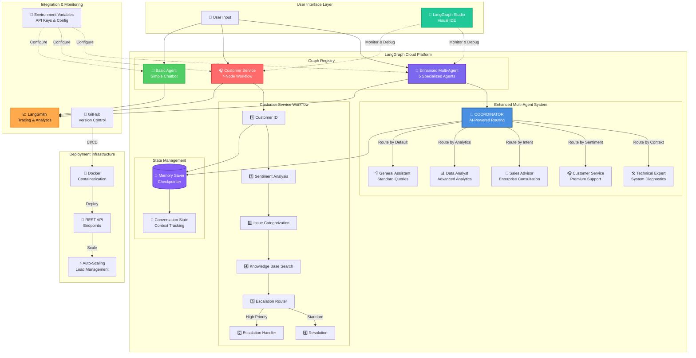

# AI LAB Customer Service Development

A LangGraph-based customer service AI agent for the AI LAB platform.

## 📊 Solution Architecture



### Key Components

- **Enhanced Multi-Agent**: 5 specialized agents with intelligent routing for complex scenarios
- **Customer Service**: 7-node workflow with sentiment analysis and escalation logic
- **Basic Agent**: Simple conversational baseline with memory persistence
- **LangGraph Cloud**: Production-ready deployment with auto-scaling
- **LangSmith Integration**: Real-time tracing, analytics, and monitoring
- **Visual IDE**: Cloud-native development and debugging interface

## 🚀 Features

- **Stateful Conversations**: Maintains context across multiple interactions
- **Memory Persistence**: Uses LangGraph's checkpointing for conversation history
- **Modular Design**: Clean separation of concerns with reusable components
- **Cloud Deployment Ready**: Configured for LangGraph Cloud deployment

## 📁 Project Structure

```
AI-LAB-Customer-Service-Dev/
├── langgraph.json          # LangGraph configuration
├── my_agent/              # Main agent package
│   ├── __init__.py        # Package initialization
│   └── graph.py           # Main graph definition
├── requirements.txt       # Python dependencies
├── env.example           # Environment variables template
└── README.md             # This file
```

## 🛠️ Setup

1. **Clone the repository**:
   ```bash
   git clone https://github.com/leadtechcorp/AI-LAB-Customer-Service-Dev.git
   cd AI-LAB-Customer-Service-Dev
   ```

2. **Create virtual environment**:
   ```bash
   python -m venv venv
   source venv/bin/activate  # On Windows: venv\Scripts\activate
   ```

3. **Install dependencies**:
   ```bash
   pip install -r requirements.txt
   ```

4. **Set up environment variables**:
   ```bash
   cp env.example .env
   # Edit .env with your API keys
   ```

## 🔧 Configuration

The `langgraph.json` file defines:
- **Dependencies**: Python packages and local modules
- **Graphs**: Entry points for your LangGraph applications
- **Environment**: Environment variable file location

## 🚀 Deployment

### Local Testing

```bash
# Test the graph locally
python -c "from my_agent.graph import graph; print('Graph loaded successfully!')"
```

### LangGraph Cloud

1. Push to GitHub repository
2. Connect repository in LangGraph Studio
3. Deploy using the web interface

## 🔑 Environment Variables

Copy `env.example` to `.env` and configure:

- `OPENAI_API_KEY`: OpenAI API key (if using OpenAI models)
- `ANTHROPIC_API_KEY`: Anthropic API key (if using Claude models)
- `LANGCHAIN_API_KEY`: LangSmith API key for tracing
- `LANGCHAIN_PROJECT`: Project name for LangSmith

## 🎯 Usage

The agent provides conversational AI capabilities with:
- Greeting and help responses
- AI LAB information
- Context-aware conversations
- Memory persistence across sessions

## 🔄 Development

To modify the agent behavior, edit `my_agent/graph.py`:
- Add new nodes for different capabilities
- Modify the conversation logic
- Integrate with external APIs or models

## 📊 Monitoring

Enable LangSmith tracing by setting:
```bash
LANGCHAIN_TRACING_V2=true
LANGCHAIN_API_KEY=your_langsmith_key
```

## 🤝 Contributing

1. Fork the repository
2. Create a feature branch
3. Make your changes
4. Submit a pull request

## 📜 License

This project is part of the AI LAB platform.
